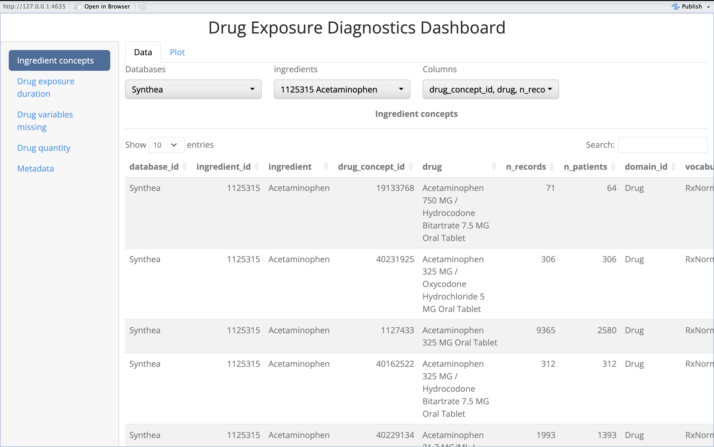

## Conectarse a la base de datos

Para esta practica vamos a usar Synthetic data **synthea-covid19-10k**, una base de datos sintetica de 10,754 personas mapeada a OMOP CDM. Para crear la connexion podeis usar las siguientes lineas de codigo:

```{r, message=TRUE}
dbName <- "synthea-covid19-10k"
CDMConnector::requireEunomia(datasetName = dbName)
con <- duckdb::dbConnect(duckdb::duckdb(), CDMConnector::eunomiaDir(datasetName = dbName))
cdm <- CDMConnector::cdmFromCon(con = con, cdmSchema = "main", writeSchema = "main")
cdm
```

## 1 Diagnostics

### Crear una 'codelist' de 'clopidogrel'

Para crear una codelist de clopidogrel podemos usar *CodelistGenerator* y el nombre del ingrediente *clopidogrel*. La codelist resultante tendria que tener 2813 concept ids:

```{r, echo=FALSE}
codelist <- CodelistGenerator::getDrugIngredientCodes(cdm = cdm, name = "clopidogrel")
codelist
```

::: {.callout-tip collapse="true" appearance="simple"}
## Pista

Puedes usar la function `CodelistGenerator::getDrugIngredientCodes()`
:::

### DrugExposureDiagnostics

Una vez creada la codelist podemos usar el paquete DrugExposureDiagnostics para analizar la calidad de los records de esta codelist en la base de datos.

Pasos:

**1) Tendremos que buscar el ingredient concept id de clopidogrel.**

::: {.callout-tip collapse="true" appearance="simple"}
## Pista 1

La tabla 'concept' (`cdm$concept`) tiene la relacion entre concept_id y concept_name. Tambien se puede buscar esta relacion en athena.
:::

::: {.callout-tip collapse="true" appearance="simple"}
## Pista 2

Puedes filtrar la tabla usando `dplyr::filter()` por ejemplo:

```{r, eval=FALSE}
cdm$concept |>
  dplyr::filter(concept_name == "my_ingredient")
```
:::

**2) Usar DrugExposureDiagnostics para obtener el diagnosticos de esta codelist:**

::: {.callout-tip collapse="true" appearance="simple"}
## Pista

Recuerda que la funcion para hacer diagnostics es: *DrugExposureDiagnostics::executeChecks*.

Recuerda usar los argumentos:

-   ingredients
-   earliestStartDate (recuerda que por defecto es '2010-01-01')
-   sample (recuerda que por defecto es 10,000)
-   outputFolder (para que los resultados se guarden en un zip)
:::

NOTE: en una base de datos completa *DrugExposureDiagnostics* puede tardar horas en obtener los resultados.

**3) Crear la shiny app con los resultados de DrugExposureDiagnostics**

::: {.callout-tip collapse="true" appearance="simple"}
## Pista

Recuerda que la funcion para crear la shiny es: *DrugExposureDiagnostics::viewResults*.

Tienes que usar el mismo 'dataFolder' donde hay los resultados en .zip
:::

```{r, echo=FALSE, eval=FALSE}
DrugExposureDiagnostics::executeChecks(
  cdm = cdm, 
  ingredients = 1322184, 
  checks = c(
    "missing", "exposureDuration", "type", "route", "sourceConcept", 
    "daysSupply", "verbatimEndDate", "dose", "sig", "quantity", 
    "diagnosticsSummary"
  ), 
  sample = NULL, 
  earliestStartDate = '1900-01-01', 
  outputFolder = here::here() 
)
DrugExposureDiagnostics::viewResults(here:::here())
```

Tendrias que ver una shiny app parecida a esta:



**4) Explora la shiny app y responde a las siguentes preguntas:**

**Q1)** Cuantos concepts ids tienen records associados?

::: {.callout-tip collapse="true" appearance="simple"}
## Pista

Puedes encontrar las respuestas en la tab con titulo: 'Ingredient concepts'
:::

::: {.callout-note collapse="true" appearance="simple"}
## Resultado

Solo un concepto tiene records: 19075601 (N = 4,179).
:::

**Q2)** Hay alguna duracion negativa? La longitud de los exposure parece plausible?

::: {.callout-tip collapse="true" appearance="simple"}
## Pista

Puedes encontrar las respuestas en la tab con titulo: 'Drug exposure duration'
:::

::: {.callout-note collapse="true" appearance="simple"}
## Resultado

No hay duraciones negativas. La longitud de los exposures parece plausible.
:::

**Q3)** Hay algun missing del que nos tengamos que preocupar?

::: {.callout-tip collapse="true" appearance="simple"}
## Pista

Puedes encontrar las respuestas en la tab con titulo: 'Drug variables missing'.

Ten en cuenta que las columnas mas importantes son: drug_concept_id, person_id, drug_exposure_start_date, drug_exposure_end_date and quantity.
:::

::: {.callout-note collapse="true" appearance="simple"}
## Resultado

Hay algunos missings, pero ninguna de las columnas que tienen missings son de vital importancia para nuestros analysis.
:::

**Q4)** Que te parecen los valores de quantity? Va a ser posible calcular dose?

::: {.callout-tip collapse="true" appearance="simple"}
## Pista

Puedes encontrar las respuestas en la tab con titulo: 'Drug quantity'.
:::

::: {.callout-note collapse="true" appearance="simple"}
## Resultado

Quantity es 0 siempre asi que no se podra calcular dose.
:::

## 2 Analyses

### Crear una cohorte

Ahora que tenemos nuestro 'codelist' podemos crear una cohorte de usuarios de 'clopidogrel', crea la cohorte considerando que prescripciones separadas por 30 dias siguen formando parte del mismo episodio de uso del medicamento. Comprueba el 'cohortCount' y compara tu resultado con el esperado.

**Q5)** Cuantos records y subjects tiene la cohorte resultante?

```{r, echo=FALSE, message=FALSE}
cdm <- DrugUtilisation::generateDrugUtilisationCohortSet(
  cdm = cdm,
  name = "my_cohort", 
  conceptSet = codelist, 
  gapEra = 30
)
```

::: {.callout-tip collapse="true" appearance="simple"}
## Pista

Recuerda que puedes usar la funcion `DrugUtilisation::generateDrugUtilisationCohortSet()` para crear cohortes de usuarios de farmacos. Con el parametro `gapEra` indicamos cuantos dias de separacion puede haber entre dos exposures para ser considerados dentro del mismo episodio.
:::

::: {.callout-note collapse="true" appearance="simple"}
## Resultado

```{r}
DrugUtilisation::cohortCount(cdm$my_cohort)
```
:::

### Nuevos usuarios

En este estudio vamos a considerar que nuevos usuarios de 'clopidogrel' son aquellos que:

-   No han usado 'clopidogrel' en los 365 dias anteriores.

-   Han estado en observacion durante los 365 dias anteriores.

-   Periodo de estudio: 1990-01-01 to any time after.

**Q6)** Cuantos records y subjects tiene la cohorte resultante? Visualizando la attrition en que paso se pierden mas personas?

::: {.callout-tip collapse="true" appearance="simple"}
## Pista

Uso del mismo medicamento anteriormente -\> `DrugUtilisation::requirePriorDrugWashout()`

En observacion antes del medicamento -\> `DrugUtilisation::requireObservationBeforeDrug()`

Periodo de estudio -\> `DrugUtilisation::requireDrugInDateRange()`
:::

::: {.callout-note collapse="true" appearance="simple"}
## Resultado

```{r, echo=FALSE, message=FALSE}
cdm$my_cohort <- cdm$my_cohort |>
  DrugUtilisation::requirePriorDrugWashout(days = 365) |>
  DrugUtilisation::requireObservationBeforeDrug(days = 365) |>
  DrugUtilisation::requireDrugInDateRange(dateRange = as.Date(c("1990-01-01", NA)))
```

```{r}
DrugUtilisation::cohortCount(cdm$my_cohort)
DrugUtilisation::attrition(cdm$my_cohort) |>
  dplyr::select("reason", "number_records")
```
:::

### Caracterizacion

Vamos a caracterizar el uso de 'clopidogrel' en nuestra cohorte de 'clopidogrel', vamos a usar un gapEra de 30 dias tal y como lo hemos hecho a la creacion de la cohorte. Vamos a caracterizar las prescripciones durante la cohorte y visualizarlo en una 'gt table'.

NOTA: Recuerda que en el diagnostics hemos visto que para este farmaco no podemos analizar quantity o dose, asi que vamos a poner estas opciones en FALSE.

**Q6)** Cuales de los resultados son esperados? Hay algun resultado sorprendente?

::: {.callout-tip collapse="true" appearance="simple"}
## Pista

Extraer uso de los medicamentos: `DrugUtilisation::summariseDrugUtilisation()`

Visualizarlo en un 'gt table': `DrugUtilisation::tableDrugUtilisation()`
:::

::: {.callout-note collapse="true" appearance="simple"}
## Resultado

```{r, echo=FALSE, message=FALSE}
dus <- cdm$my_cohort |>
  DrugUtilisation::summariseDrugUtilisation(
    conceptSet = codelist, 
    estimates = c("median", "q25", "q75"),
    initialQuantity = FALSE, cumulativeQuantity = FALSE, 
    initialDailyDose = FALSE, cumulativeDose = FALSE
  )
DrugUtilisation::tableDrugUtilisation(
  result = dus, 
  header = "cdm_name", 
  groupColumn = "cohort_name", 
  hide = c("censor_date", "cohort_table_name", "gap_era", "index_date", 
           "restrict_incident", "concept_set", "variable_level")
)
```
:::

### Indicacion

Encuentra cuales son las posibles indicaciones de los usuarios de 'clopidogrel'. Considera como posibles indicaciones: "Coronary arteriosclerosis" (317576) y "Cerebrovascular accident" (381316), ademas busca cuanta gente tiene algun otro record ("Unknown indication") en "condition_occurrence". Busca indications en: \[-365, 0\] y \[0, 0\] respecto el index date. Visualiza el resultado en una 'gt' table.

**Q6)** Cambia mucho el resultado por usar distintas ventanas?

**Q70000000)** Cuando el resultado de 'unknown' es un porcentaje significante seguramente hariamos una large scale characterisation para ver que records estan presentes, crees que hace falta en este caso?

::: {.callout-tip collapse="true" appearance="simple"}
## Crear indications cohort

Para instanciar la cohorte con las indications puedes usar el siguiente codigo:

```{r, message=FALSE}
cdm <- CDMConnector::generateConceptCohortSet(
  cdm = cdm, 
  conceptSet = list(coronary_arteriosclerosis = 317576, cerebrovascular_accident = 381316), 
  name = "indications", 
  limit = "all", 
  end = 0
)
```
:::

::: {.callout-tip collapse="true" appearance="simple"}
## Pista

Puedes analizar la indicacion con la funcion `DrugUtilisation::summariseIndication()` y despues visualizarla con `DrugUtilisation::tableIndication()`.
:::

::: {.callout-note collapse="true" appearance="simple"}
## Resultado

```{r, echo=FALSE, message=FALSE}
result <- cdm$my_cohort |>
  DrugUtilisation::summariseIndication(
    indicationCohortName = "indications", 
    indicationWindow = list(c(-365, 0), c(0, 0)), 
    unknownIndicationTable = "condition_occurrence"
  )
DrugUtilisation::tableIndication(result, hide = c(
  "censor_date", "cohort_table_name", "index_date", "indication_cohort_name", 
  "mutually_exclusive", "unknown_indication_table", "window_name"
))
```
:::

### Comedications

Vamos a analizar las medicaciones que se toman simultaniamente a 'clopidogrel', los candidatos van a ser 3 otros ingredientes: 'warfarin', 'enoxaparin' y 'alteplase'.

Pasos:

-   Crear la codelist de medicaciones alternativas

-   Crear la cohorte de medicaciones alternativas

-   Usar la funcion `DrugUtilisation::summariseTreatment()` para ver los tratamientos simultaneos, que valor hay que poner en 'indexDate', 'censorDate' y 'window'?

-   Visualiza los resultados con la funcion `DrugUtilisation::plotTreatment()`.

    **Qx)** Cual es la comedicacion mas comun?

::: {.callout-note collapse="true" appearance="simple"}
## Resultado

```{r, echo=FALSE, message=FALSE}
alternativeTreatments <- CodelistGenerator::getDrugIngredientCodes(
  cdm = cdm, name = c("warfarin", "enoxaparin", "alteplase"), nameStyle = "{concept_name}"
)
cdm <- DrugUtilisation::generateDrugUtilisationCohortSet(
  cdm = cdm, name = "treatments", conceptSet = alternativeTreatments
)
treatmentsDuring <- cdm$my_cohort |>
  DrugUtilisation::summariseTreatment(
    window = c(0, Inf), 
    indexDate = "cohort_start_date",
    censorDate = "cohort_end_date", 
    treatmentCohortName = "treatments"
  )
DrugUtilisation::plotTreatment(treatmentsDuring)
```
:::

### Medications antes y despues

Vamos a analizar que medicamentos de estos 3 se han usado antes o despues de empezar el tratamiento. Vamos a usar la misma funcion que antes pero en vez de analizar el durante vamos a analizar el antes y el despues, definimos 5 ventanas: \[-360, -181\], \[-180, -1\], \[0, 0\], \[1, 180\] y \[181, 360\] y vamos a ver que tratamientos se usaron.

**Qx)** Hay algun medicamento que se tome antes o despues del 'clopidogrel'?

::: {.callout-note collapse="true" appearance="simple"}
## Resultado

```{r, echo=FALSE, message=FALSE}
treatmentsAfter <- cdm$my_cohort |>
  DrugUtilisation::summariseTreatment(
    window = list(c(-360, -181), c(-180, -1), c(0, 0), c(1, 180), c(181, 360)), 
    indexDate = "cohort_start_date",
    treatmentCohortName = "treatments"
  )
DrugUtilisation::plotTreatment(treatmentsAfter)
```
:::

### Discontinuation

Para analizar cuanto tardan los pacientes en dejar la medicacion podemos usar 'proportion of patients covered' durante los 365 dias despues de iniciar el tratamiento.

**Qx)** Que vemos? Hay algun momento que muchos pacientes dejen la medicacion al mismo tiempo?

::: {.callout-tip collapse="true" appearance="simple"}
## Pista

Puedes analizar PPC con la funcion `DrugUtilisation::summariseProportionOfPatientsCovered()` y despues visualizarlo con `DrugUtilisation::plotProportionOfPatientsCovered()`.
:::

::: {.callout-note collapse="true" appearance="simple"}
## Resultado

```{r, echo=FALSE, message=FALSE}
ppc <- DrugUtilisation::summariseProportionOfPatientsCovered(cdm$my_cohort, followUpDays = 365)
DrugUtilisation::plotProportionOfPatientsCovered(ppc)
```
:::

### Drug restart and switch

Vamos a usar las mismas cohortes que hemos usado antes ('warfarin', 'enoxaparin' y 'alteplase') para ver si despues de terminar el tratamiento de 'clopidogrel' los usuarios cambian a alguna de ellas o vuelven a empezar el tratamiento.

::: {.callout-note collapse="true" appearance="simple"}
## Resultado

```{r, echo=FALSE, message=FALSE}
restart <- cdm$my_cohort |>
  DrugUtilisation::summariseDrugRestart(
    followUpDays = c(120, 240, 360),
    switchCohortTable =  "treatments", 
    incident = TRUE
  )
DrugUtilisation::plotDrugRestart(restart)
```
:::
